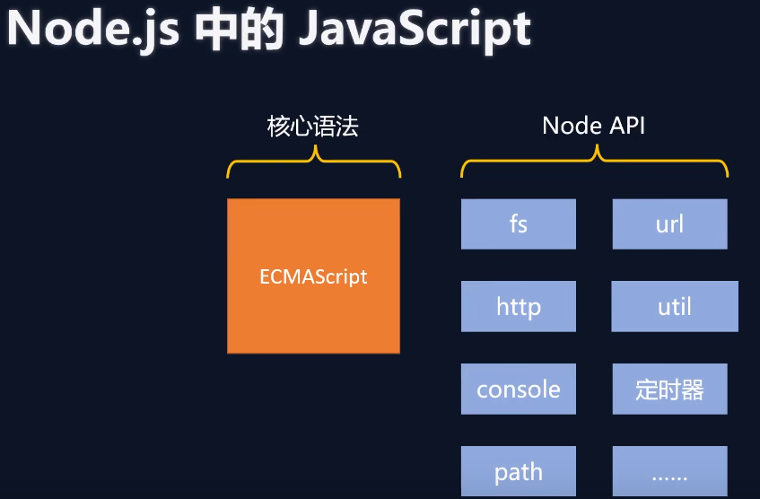

# 0.nodeJs引入

## 1.JavaScript在浏览器和nodeJS中的区别

### 1.底层架构




***以下API均不可再用：***

+ `window`
+ `history`
+ `navigator`
+ `location`
+ `ajax`
+ ...

***可用的公共API：***

+ `console`
+ `定时器`
  ```javascript
  setTimeout(()=>{
      console.log("延迟1秒");
  },1000);
  
  setInterval(()=>{
      console.log("间隔1s，循环下去")
  },1000);
  
  ```

### 2.顶级对象不同

 + 浏览器中顶级对象：`window`
 + nodeJs中顶级对象：`global` (必须小写)，当然也可以使用`globalThis`指向`global`(ES2020引入的规范)

## 2. Node.js中使用模版字符串

```javascript
//正常字符串
let str1 = __dirname+"a.txt";
let str2 = __dirname+'\a.txt';
//模版字符串  用反引号``取变量的值
let str3=`${__dirname}\a.txt`;
```

# 1.Buffer（缓冲器）

## 1.概念 

Buffer 是一个类似于数组的 对象 ，用于表示**固定长度的字节序列**。

Buffer 本质是一段内存空间，专门用来处理 二进制数据 。


## 2.特点

+ Buffer大小固定且无法调整
+ Buffer性能较好，可以直接对计算机内存进行操作
+ 每个元素的大小为1字节（byte 8位）


## 3.使用

**Buffer整体输出默认是16进制，单独输出默认是10进制**

### 3.1 Node.js中创建Buffer的三种方式：

下面三种方式，输出都是Unicode格式，16进制表示的（Unicode兼容ASCII，所以部分一样）

+ `Buffer.alloc(10)`

  ```javascript
  //在内存中分配指定长度的Buffer，并对其进行置0，10就表示10个字节，1个字节8位
  let buf_1 = Buffer.alloc(10);
  console.log(buf_1);//输出 <Buffer 00 00 00 00 00 00 00 00 00 00>
  ```

+ `BUffer.allocUnsafe(10000)`

  ```javascript
  //和上面不同的是，不对内存进行置0操作，所以可能会有脏数据，优点：比上面的快（不置零）
  let buf_2 = Buffer.allocUnsafe(10000);
  console.log(buf_2);、
  //输出<Buffer 80 00 30 03 00 00 00 00 a0 63 2e 03 00 00 00 00 00 20 00 00 00 00 00 00 00 00 00 00 00 00 00 00 00 00 00 00 00 00 00 00 00 00 00 00 00 00 00 00 ff ff ... 9950 more bytes>
  ```

+ `Buffer.from("hello")`，可以将**字符串**或者**十进制的数字数组**转成Buffer

  ```javascript
  let buf_3 = Buffer.from("hello");
  //h-对应ascii的十进制 104- 对应16进制的 68
  console.log(buf_3);//输出<Buffer 68 65 6c 6c 6f>
  let buf_4 = Buffer.from(['h','e','l','l','o',0]);
  console.log(buf_4);//输出<Buffer 00 00 00 00 00 00>，因为只接受数字数组
  let buf_5 = Buffer.from([104,101,108,108,111]);
  console.log(buf_5.toString());//输出hello
  ```

### 3.2 Buffer与字符串的相互转换

+ Buffer整体转字符串，默认采用utf8编码

  ```javascript
  let buf_5 = Buffer.from([104,101,108,108,111]);
  console.log(buf_5.toString());//输出hello
  ```

  > [Node.js支持的字符编码：ascii,utf8,utf16le,ucs2,base64,latin1,binary,hex](https://www.runoob.com/nodejs/nodejs-buffer.html)

+ 字符串转Buffer

  ```javascript
  let buf_3 = Buffer.from("hello");
  console.log(buf_3);//输出<Buffer 68 65 6c 6c 6f>
  ```

  ### 3.3 Biuffer的读写

  由于Buffer类似于数组，所以可以利用下标进行读写

  + Buffer单字节读

    ```javascript
    let buf_6 = Buffer.from("hello");
    console.log(buf_6[0]);//默认十进制  104
    //注意这里的单个buffer字节的toString()代表的是进制转换，默认就是十进制
    console.log(buf_6[0].toString(2))//转成2进制 1101000
    console.log(buf_6[0].toString(16))//转成16进制 68
    ```

  + Buffer单字节写

    ```javascript
    let buf_6 = Buffer.from("hello");
    buf_6[0]=99;
    console.log(buf_6);//<Buffer 63 65 6c 6c 6f>
    console.log(buf_6.toString());//cello
    ```

  + Buffer溢出

    因为Buffer中1个字节是8位，所以单个字节最大可表示的数字为2^8-1=255个，如果赋值超过这个限制，就是把**超过8位的数据进行舍弃**。

    ```javascript
    let buf_6 = Buffer.from("hello");
    //大于255
    buf_6[0]=555;//555的二进制为：10 0010 1011,那么舍弃后就是0010 1011,对应十进制43
    console.log(buf_6[0]);
    ```

    ### 3.3 Buffer存储中文

    utf8格式下，1个中文字符占用3个字节

    ```javascript
    let buf_7=Buffer.from("你好");//6位unicode 16进制
    console.log(buf_7);//<Buffer e4 bd a0 e5 a5 bd>
    ```

# 2 fs

fs 全称为 file system ，称之为 文件系统 ，是 Node.js 中的 内置模块 ，可以对计算机中的磁盘进行操
作。其主要作用如下：

+ 文件写入
+ 文件读取
+ 文件移动与重命名
+ 文件删除
+ 文件夹操作
+ 查看资源状态

## 1. 文件写入

文件写入就是将 数据 保存到 文件 中，我们可以使用如下几个方法来实现该效果：

| 方法              | 说明         |
| ----------------- | ------------ |
| writeFile         | 异步覆盖写入 |
| writeFileSync     | 同步覆盖写入 |
| appendFile        | 异步追加     |
| appendFileSync    | 同步追加     |
| createWriteStream | 流失写入     |

> **注：**这里的同步异步的意思就是，脚本执行到这里
>
> + 同步，等待文件操作完才会执行下面的代码
> + 异步，将文件操作交另外一个线程,**回调函数就会排在主线程的最后**，继续执行下面代码，直到主线程脚本执行完，按照队列顺序执行异步回调函数

### 1.1 writeFile 异步写入

语法： `fs.writeFile(file, data[, options], callback)`

参数说明：

+ `file` 文件名
+ `data` 待写入的数据
+ `options` 选项设置 （可选）包含 {encoding, mode, flag}。默认编码为 utf8, 模式为 0666 ， flag 为 'w'
+ `callback` 写入回调，如果有错误，返回参数必是err

返回值： `undefined`

 代码示例：

```javascript
const fs = require('fs');//导入Node.js底层文件，fs.js
fs.writeFile('./你好.txt','你好，hello',{flag:w},err => {
    //回调函数，无论是否成功都会调用，如果失败异常写入err
    if(err) {
        console.log(err);
        return;
    }
    console.log("文件写入成功！");
});

setTimeout(() => {
    console.log("等待3s"); //这个也是异步回调
},3000);// 这个是主线程等待3秒
console.log("程序结束！");

/*
最后输出：
	程序结束！（主程序结尾）
	文件写入成功！（异步回调返回队列）
	等待3s  （异步回调返回队列）
*/
```

### 1.2 writeFileSync 同步写入

语法: `fs.writeFileSync(file, data[, options])`

参数跟`writeFile()`大体一致，只是没有callback参数

返回值：`undifined`

代码实例：

```javascript
const fs = require('fs');
try{
    fs.writeFileSync('./你好.txt','你好，hello9999',{flag:w});
}catch(e){
    console.log(e);
}
setTimeout(() => {
    console.log("等待3s"); //异步
},3000);
console.log("程序结束！");
```

### 1.3 appendFile[Sync] 追加写入

appendFile 作用是在文件尾部追加内容，appendFile 语法与 writeFile 语法完全相同。

语法：

+ `fs.appendFile(file, data[, options], callback)` 异步写入
+ `fs.appendFileSync(file, data[, options])` 同步追加

代码实例：

```javascript
const fs = require('fs');
fs.appendFile("./你好.txt","\r\nhello，你好！",err => {
    if(err) {
        console.log(err);
        return;
    }
    console.log("追加成功！");
})
console.log("程序结束！");
/*
异步追加输出：
程序结束！
追加成功！
*/

fs.appendFileSync("./你好.txt","\r\nohayo,...");
console.log('程序结束');
/*
同步追加输出：
程序结束！
*/
```

### 1.4 createWriteStream 流式写入

语法：

`let ws=fs.createWriteStream(path[, options])`

参数：

+ path：文件路径
+ options 可选配置

返回值：`Object`

代码示例：

```javascript
const fs = require('fs');
//适合频繁写入和大文件，图片视频等
let ws = fs.createWriteStream('./儿歌.txt');
ws.write("一二三四五，");
ws.write("上山打老虎。");
ws.write("老虎没打到，");
ws.write("打到一只小松鼠。");
ws.close();
```

> 程序打开一个文件是需要消耗资源的 ，流式写入可以减少打开关闭文件的次数。
> 流式写入方式适用于 大文件写入或者频繁写入 的场景, writeFile 适合于 写入频率较低的场景

### 1.5  写入文件的场景

当 需要持久化保存数据 的时候，应该想到 文件写入

+ 下载文件
+ 安装软件
+ 保存日志
+ 编辑文件
+ 视频录制
+ ...

## 2. 文件读取

文件读取顾名思义，就是通过程序从文件中取出其中的数据，我们可以使用如下几种方式：

| 方法             | 说明     |
| ---------------- | -------- |
| readFile         | 异步读取 |
| readFileSync     | 同步读取 |
| createReadStream | 流式读取 |

### 1. readFile 异步读取

语法：

` fs.readFile(path[, options], callback)`

参数说明：

+ path 文件路径
+ options 选项配置
+ callback 回调函数

返回值：`udefined`

代码示例：

```javascript
const fs=require('fs');
fs.readFile("./儿歌.txt",(err, data) => {
    if(err) {
        console.log(err);
        return;
    }
    //返回的数据为Buffer类型
    console.log(data.toString());
});
```

### 2. readFileSync 同步读取

语法： 

`fs.readFileSync(path[, options])`

参数说明：

+ path 文件路径
+ options 选项配置

返回值：`string|Buffer`

代码示例：

```javascript
let content=fs.readFileSync("./儿歌.txt");
let content1=fs.readFileSync("./儿歌.txt",{encoding:'utf8'});
console.log(content.toString());
console.log(content1);
```

### 3. createReadStream流式读取

每次最大读取64KB大小数据，理论上占用64KB，但是实际读取比写入的快，所以肯定是大于64KB的。

语法：

` fs.createReadStream(path[, options])`

参数：

+ path 文件路径
+ options 选项配置

返回值：`Object`

```javascript
const fs=require('fs');
let rs=fs.createReadStream("C:\\Users\\Administrator\\Pictures\\a.jpg");
let size = 0;
//需要给读取流绑定一个 on data事件
rs.on('data', chunk => {
    //console.log(chunk.length);//65536 最大一次可读去64kb块,
    size += chunk.length;
    //读一次64kb数据，调用回调函数，继续读取，调用回调，...直到读取完成
});
//可选的 on end事件，代表读取文件成功
rs.on('end',() =>{
    console.log("图片读取成功, 共" + size + "字节");
});
```

## 3. 文件移动与重命名

在 Node.js 中，我们可以使用 `rename` 或 `renameSync` 来移动或重命名 文件或文件夹

语法：

+ `fs.rename(oldPath, newPath, callback)`
+ `fs.renameSync(oldPath, newPath)`

参数：

+ `oldPath` 源路径
+ `newPath` 新路径
+ `callback`回调函数，只有一个形参err

## 4. 文件删除

在 Node.js 中，我们可以使用 unlink 或 unlinkSync 来删除文件

语法：

+ `fs.unlink(path, callback)`
+ `fs.unlinkSync(path)`
+ `fs.rm(path,callback)` node14.4引入
+ `fs.rmSync(path)` node14.4引入

参数说明：

+ path 文件路径
+ callback 操作后的回调，只有一个err形参

代码示例：

```javascript
const fs = require('fs');
fs.unlink('a.jpg',err => {
    if (err) {
        console.log(err);
        return;
    }
    console.log("删除成功");
});

fs.rm("你好.txt",err => {
    if (err) {
        console.log(err);
        return;
    }
    console.log("删除成功");
});
```

## 5. 文件夹操作

借助 Node.js 的能力，我们可以对文件夹进行 创建 、 读取 、 删除 等操作

| 方法                | 说明              |
| ------------------- | ----------------- |
| mkdir/mkdirSync     | 异/同步创建文件夹 |
| readdir/readdirSync | 异/同步读取文件夹 |
| rmdir/rmdirSync     | 异/同步删除文件夹 |

### 1. mkdir 创建文件夹

在 Node.js 中，我们可以使用 mkdir 或 mkdirSync 来创建文件夹

语法：

+ `fs.mkdir(path[, options], callback)`
+ `fs.mkdirSync(path[, options])`

参数：

+ path 文件夹路径

+ options 可选操作

  > - **recursive** - 是否以递归的方式创建目录，默认为 false。
  > - **mode** - 设置目录权限，默认为 0777。

+ callback 回调函数，只有err一个形参

代码示例：

```javascript
const fs=require('fs');
fs.mkdir("./html",err=>{});//单目录创建
fs.mkdir("./a/b/c/d",{recursive:true},err=>{});//递归创建文件夹
```

### 2. readdir 读取文件夹

**把名字读取到，不读取其子目录（如有）**

语法：

+ `fs.readdir(path[, options], callback)`
+ `fs.readdirSync(path[, options])`

参数：

+ path 文件夹路径
+ options 可选操作（编码、文件类型等）
+ callback 回调函数，有err和data两个形参

代码示例：

```javascript
const fs=require('fs');
fs.readdir('./',(err,data) => {
    if (err) {
        console.log(err);
        return;
    }
    console.log(data);//文件带后缀，目录就只读取这一层
})
```

### 3. rmdir 删除文件夹

在 Node.js 中，我们可以使用 `rmdir` 、 `rmdirSync `或`rm (带递归flag)`、`rmSync (带递归flag)`来删除文件夹

语法：

+ `fs.rmdir(path[, options], callback)`
+ `fs.rmdirSync(path[, options])`
+ `fs.rm(path, {recursive:true,..}, callback)`
+ `fs.rmSync(path, {recursive:true,..})`

参数说明：

+ path 文件夹路径
+ options 选项配置（ 可选 如重试次数，重试间隔时间，是否递归删除等待）
+ callback 操作后的回调 只有err一个形参

返回值：`undefined`

代码演示：

```javascript
//1
fs.rmdir('./html',err=>{
    if(err){
        console.log(err);
    }
});//只删除单层空目录，若非空会报错
//2 Deprecate 不推荐
fs.rmdir('./html',{recursive:true},err=>{
    if(err){
        console.log(err);
    }
});//可递归删除目录，不管里面是否有文件
//3 rm删除文件夹必须带递归删除标识，否则会报错
fs.rm('./a',{recursive:true},err=>{
    if (err) {
        console.log(err);
    }
})

```

## 6. 查看文件/文件夹状态信息

在 Node.js 中，我们可以使用 `stat`或 `statSync`来查看资源（文件或目录）的详细信息

语法：

+ `fs.stat(path[, options], callback)`
+ `fs.statSync(path[, options])`

参数：

+ path 文件路径
+ options 可选配置
+ callback 回调函数，有err和stat两个形参

返回值：void

代码示例：

```javascript
const fs=require('fs');
fs.stat('./fs-stat.js',(err,stat)=>{
    if(err) {
        console.log(err);
        return;
    }
    console.log(stat);
    console.log(stat.isFile());//是否为文件
    console.log(stat.isDirectory());//是否为目录  【等等。。块设备，fifo，socket等等】
}
        
/* 输出
Stats {
  dev: 4100191142,
  mode: 33206,
  nlink: 1,
  uid: 0,
  gid: 0,
  rdev: 0,
  blksize: 4096,
  ino: 3940649674145708,
  size: 311,//文件大小
  blocks: 0,
  atimeMs: 1679383161123.4019,
  mtimeMs: 1679383425918.4019,
  ctimeMs: 1679383425918.4019,
  birthtimeMs: 1679383161123.4019,
  atime: 2023-03-21T07:19:21.123Z,//最后一次访问时间
  mtime: 2023-03-21T07:23:45.918Z,//最后一次修改文件内容时间
  ctime: 2023-03-21T07:23:45.918Z,//最后一次修改文件状态时间
  birthtime: 2023-03-21T07:19:21.123Z//创建时间
}
true//是文件
false//不是目录

*/
```

## 7. 相对路径问题

和别的地方一样

程序在哪个地方运行，哪个目录就是 . (当前目录)。

所以要注意程序的运行位置，防止相对路径下产生的文件不在预想的位置。

## 8. __dirname

可以理解为和require一样的全局变量，但是实际上并不是。

__dirname始终保存的是当前运行脚本的绝对路径，就可以避免7中，运行目录不同导致相对路径的问题。

+ `__dirname` 保存当前运行脚本的所在目录（绝对路径）
+ `__filename` 保存当前运行脚本的所在位置（绝对路径）

# 3 path

path 模块提供了 操作资源路径 的功能，我们将介绍如下几个较为常用的几个 API：

| API           | 说明                                   |
| ------------- | -------------------------------------- |
| path.resolve  | 根据当前系统，拼接出规范的绝对路径     |
| path.sep      | 获取当前操作系统的路径分隔符           |
| path.parse    | 解析路径并返回文件对象                 |
| path.basename | 获取文件的基础名称(没有路径，包含后缀) |
| path.dirname  | 获取文件目录                           |
| path.ext      | 获取文件后缀名                         |

代码实例：

```javascript
const path=require('path');
//D:\0\JWork\vscode\nodeJS\src\3-path\index.html\a.txt
console.log(path.resolve(__dirname,'./index.html','a.txt'));//相对路径
console.log(path.resolve(__dirname,'index.html','a.txt'));//相对路径
//D:\index.html\a.txt 切记第一个绝对路径为准，后面就跟在后面了
console.log(path.resolve(__dirname,'/index.html','a.txt'));//绝对路径

console.log(`${__dirname}/a.txt`);//模版字符串，反引号取变量值

console.log(path.sep);// \
//{ root: '', dir: '.', base: 'path.js', ext: '.js', name: 'path' }
console.log(path.parse('./path.js'));//输入什么路径，就返回什么路径
console.log(path.basename('./path.js'));//path.js
console.log(path.dirname('./path.js'));//.
console.log(path.extname('./path.js'));//.js
```

4.
