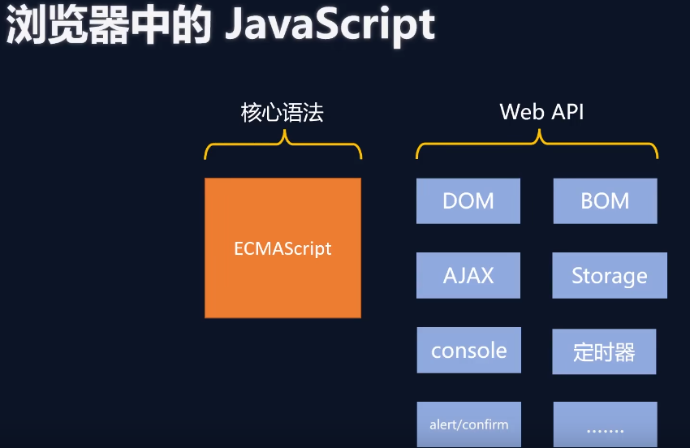

# 0.nodeJs引入

## 1.JavaScript在浏览器和nodeJS中的区别

### 1.底层架构




***以下API均不可再用：***

+ `window`
+ `history`
+ `navigator`
+ `location`
+ `ajax`
+ ...

***可用的公共API：***

+ `console`
+ `定时器`
  ```javascript
  setTimeout(()=>{
      console.log("延迟1秒");
  },1000);
  
  setInterval(()=>{
      console.log("间隔1s，循环下去")
  },1000);
  
  ```

### 2.顶级对象不同

 + 浏览器中顶级对象：`window`
 + nodeJs中顶级对象：`global` (必须小写)，当然也可以使用`globalThis`指向`global`(ES2020引入的规范)

## 2. Node.js中使用模版字符串

```javascript
//正常字符串
let str1 = __dirname+"a.txt";
let str2 = __dirname+'\a.txt';
//模版字符串  用反引号``取变量的值
let str3=`${__dirname}\a.txt`;
```

## 3.Node.js网址

API：https://nodejs.org/zh-cn/docs

插件库：https://www.npmjs.com/


# 1.Buffer（缓冲器）

## 1.概念 

Buffer 是一个类似于数组的 对象 ，用于表示**固定长度的字节序列**。

Buffer 本质是一段内存空间，专门用来处理 二进制数据 。


## 2.特点

+ Buffer大小固定且无法调整
+ Buffer性能较好，可以直接对计算机内存进行操作
+ 每个元素的大小为1字节（byte 8位）


## 3.使用

**Buffer整体输出默认是16进制，单独输出默认是10进制**

### 3.1 Node.js中创建Buffer的三种方式：

下面三种方式，输出都是Unicode格式，16进制表示的（Unicode兼容ASCII，所以部分一样）

+ `Buffer.alloc(10)`

  ```javascript
  //在内存中分配指定长度的Buffer，并对其进行置0，10就表示10个字节，1个字节8位
  let buf_1 = Buffer.alloc(10);
  console.log(buf_1);//输出 <Buffer 00 00 00 00 00 00 00 00 00 00>
  ```

+ `BUffer.allocUnsafe(10000)`

  ```javascript
  //和上面不同的是，不对内存进行置0操作，所以可能会有脏数据，优点：比上面的快（不置零）
  let buf_2 = Buffer.allocUnsafe(10000);
  console.log(buf_2);、
  //输出<Buffer 80 00 30 03 00 00 00 00 a0 63 2e 03 00 00 00 00 00 20 00 00 00 00 00 00 00 00 00 00 00 00 00 00 00 00 00 00 00 00 00 00 00 00 00 00 00 00 00 00 ff ff ... 9950 more bytes>
  ```

+ `Buffer.from("hello")`，可以将**字符串**或者**十进制的数字数组**转成Buffer

  ```javascript
  let buf_3 = Buffer.from("hello");
  //h-对应ascii的十进制 104- 对应16进制的 68
  console.log(buf_3);//输出<Buffer 68 65 6c 6c 6f>
  let buf_4 = Buffer.from(['h','e','l','l','o',0]);
  console.log(buf_4);//输出<Buffer 00 00 00 00 00 00>，因为只接受数字数组
  let buf_5 = Buffer.from([104,101,108,108,111]);
  console.log(buf_5.toString());//输出hello
  ```

### 3.2 Buffer与字符串的相互转换

+ Buffer整体转字符串，默认采用utf8编码

  ```javascript
  let buf_5 = Buffer.from([104,101,108,108,111]);
  console.log(buf_5.toString());//输出hello
  ```

  > [Node.js支持的字符编码：ascii,utf8,utf16le,ucs2,base64,latin1,binary,hex](https://www.runoob.com/nodejs/nodejs-buffer.html)

+ 字符串转Buffer

  ```javascript
  let buf_3 = Buffer.from("hello");
  console.log(buf_3);//输出<Buffer 68 65 6c 6c 6f>
  ```

  ### 3.3 Biuffer的读写

  由于Buffer类似于数组，所以可以利用下标进行读写

  + Buffer单字节读

    ```javascript
    let buf_6 = Buffer.from("hello");
    console.log(buf_6[0]);//默认十进制  104
    //注意这里的单个buffer字节的toString()代表的是进制转换，默认就是十进制
    console.log(buf_6[0].toString(2))//转成2进制 1101000
    console.log(buf_6[0].toString(16))//转成16进制 68
    ```

  + Buffer单字节写

    ```javascript
    let buf_6 = Buffer.from("hello");
    buf_6[0]=99;
    console.log(buf_6);//<Buffer 63 65 6c 6c 6f>
    console.log(buf_6.toString());//cello
    ```

  + Buffer溢出

    因为Buffer中1个字节是8位，所以单个字节最大可表示的数字为2^8-1=255个，如果赋值超过这个限制，就是把**超过8位的数据进行舍弃**。

    ```javascript
    let buf_6 = Buffer.from("hello");
    //大于255
    buf_6[0]=555;//555的二进制为：10 0010 1011,那么舍弃后就是0010 1011,对应十进制43
    console.log(buf_6[0]);
    ```

    ### 3.3 Buffer存储中文

    utf8格式下，1个中文字符占用3个字节

    ```javascript
    let buf_7=Buffer.from("你好");//6位unicode 16进制
    console.log(buf_7);//<Buffer e4 bd a0 e5 a5 bd>
    ```

# 2 fs

fs 全称为 file system ，称之为 文件系统 ，是 Node.js 中的 内置模块 ，可以对计算机中的磁盘进行操
作。其主要作用如下：

+ 文件写入
+ 文件读取
+ 文件移动与重命名
+ 文件删除
+ 文件夹操作
+ 查看资源状态

## 1. 文件写入

文件写入就是将 数据 保存到 文件 中，我们可以使用如下几个方法来实现该效果：

| 方法              | 说明         |
| ----------------- | ------------ |
| writeFile         | 异步覆盖写入 |
| writeFileSync     | 同步覆盖写入 |
| appendFile        | 异步追加     |
| appendFileSync    | 同步追加     |
| createWriteStream | 流失写入     |

> **注：**这里的同步异步的意思就是，脚本执行到这里
>
> + 同步，等待文件操作完才会执行下面的代码
> + 异步，将文件操作交另外一个线程,**回调函数就会排在主线程的最后**，继续执行下面代码，直到主线程脚本执行完，按照队列顺序执行异步回调函数

### 1.1 writeFile 异步写入

语法： `fs.writeFile(file, data[, options], callback)`

参数说明：

+ `file` 文件名
+ `data` 待写入的数据
+ `options` 选项设置 （可选）包含 {encoding, mode, flag}。默认编码为 utf8, 模式为 0666 ， flag 为 'w'
+ `callback` 写入回调，如果有错误，返回参数必是err

返回值： `undefined`

 代码示例：

```javascript
const fs = require('fs');//导入Node.js底层文件，fs.js
fs.writeFile('./你好.txt','你好，hello',{flag:w},err => {
    //回调函数，无论是否成功都会调用，如果失败异常写入err
    if(err) {
        console.log(err);
        return;
    }
    console.log("文件写入成功！");
});

setTimeout(() => {
    console.log("等待3s"); //这个也是异步回调
},3000);// 这个是主线程等待3秒
console.log("程序结束！");

/*
最后输出：
	程序结束！（主程序结尾）
	文件写入成功！（异步回调返回队列）
	等待3s  （异步回调返回队列）
*/
```

### 1.2 writeFileSync 同步写入

语法: `fs.writeFileSync(file, data[, options])`

参数跟`writeFile()`大体一致，只是没有callback参数

返回值：`undifined`

代码实例：

```javascript
const fs = require('fs');
try{
    fs.writeFileSync('./你好.txt','你好，hello9999',{flag:w});
}catch(e){
    console.log(e);
}
setTimeout(() => {
    console.log("等待3s"); //异步
},3000);
console.log("程序结束！");
```

### 1.3 appendFile[Sync] 追加写入

appendFile 作用是在文件尾部追加内容，appendFile 语法与 writeFile 语法完全相同。

语法：

+ `fs.appendFile(file, data[, options], callback)` 异步写入
+ `fs.appendFileSync(file, data[, options])` 同步追加

代码实例：

```javascript
const fs = require('fs');
fs.appendFile("./你好.txt","\r\nhello，你好！",err => {
    if(err) {
        console.log(err);
        return;
    }
    console.log("追加成功！");
})
console.log("程序结束！");
/*
异步追加输出：
程序结束！
追加成功！
*/

fs.appendFileSync("./你好.txt","\r\nohayo,...");
console.log('程序结束');
/*
同步追加输出：
程序结束！
*/
```

### 1.4 createWriteStream 流式写入

语法：

`let ws=fs.createWriteStream(path[, options])`

参数：

+ path：文件路径
+ options 可选配置

返回值：`Object`

代码示例：

```javascript
const fs = require('fs');
//适合频繁写入和大文件，图片视频等
let ws = fs.createWriteStream('./儿歌.txt');
ws.write("一二三四五，");
ws.write("上山打老虎。");
ws.write("老虎没打到，");
ws.write("打到一只小松鼠。");
ws.close();
```

> 程序打开一个文件是需要消耗资源的 ，流式写入可以减少打开关闭文件的次数。
> 流式写入方式适用于 大文件写入或者频繁写入 的场景, writeFile 适合于 写入频率较低的场景

### 1.5  写入文件的场景

当 需要持久化保存数据 的时候，应该想到 文件写入

+ 下载文件
+ 安装软件
+ 保存日志
+ 编辑文件
+ 视频录制
+ ...

## 2. 文件读取

文件读取顾名思义，就是通过程序从文件中取出其中的数据，我们可以使用如下几种方式：

| 方法             | 说明     |
| ---------------- | -------- |
| readFile         | 异步读取 |
| readFileSync     | 同步读取 |
| createReadStream | 流式读取 |

### 1. readFile 异步读取

语法：

` fs.readFile(path[, options], callback)`

参数说明：

+ path 文件路径
+ options 选项配置
+ callback 回调函数

返回值：`udefined`

代码示例：

```javascript
const fs=require('fs');
fs.readFile("./儿歌.txt",(err, data) => {
    if(err) {
        console.log(err);
        return;
    }
    //返回的数据为Buffer类型
    console.log(data.toString());
});
```

### 2. readFileSync 同步读取

语法： 

`fs.readFileSync(path[, options])`

参数说明：

+ path 文件路径
+ options 选项配置

返回值：`string|Buffer`

代码示例：

```javascript
let content=fs.readFileSync("./儿歌.txt");
let content1=fs.readFileSync("./儿歌.txt",{encoding:'utf8'});
console.log(content.toString());
console.log(content1);
```

### 3. createReadStream流式读取

每次最大读取64KB大小数据，理论上占用64KB，但是实际读取比写入的快，所以肯定是大于64KB的。

语法：

` fs.createReadStream(path[, options])`

参数：

+ path 文件路径
+ options 选项配置

返回值：`Object`

```javascript
const fs=require('fs');
let rs=fs.createReadStream("C:\\Users\\Administrator\\Pictures\\a.jpg");
let size = 0;
//需要给读取流绑定一个 on data事件
rs.on('data', chunk => {
    //console.log(chunk.length);//65536 最大一次可读去64kb块,
    size += chunk.length;
    //读一次64kb数据，调用回调函数，继续读取，调用回调，...直到读取完成
});
//可选的 on end事件，代表读取文件成功
rs.on('end',() =>{
    console.log("图片读取成功, 共" + size + "字节");
});
```

## 3. 文件移动与重命名

在 Node.js 中，我们可以使用 `rename` 或 `renameSync` 来移动或重命名 文件或文件夹

语法：

+ `fs.rename(oldPath, newPath, callback)`
+ `fs.renameSync(oldPath, newPath)`

参数：

+ `oldPath` 源路径
+ `newPath` 新路径
+ `callback`回调函数，只有一个形参err

## 4. 文件删除

在 Node.js 中，我们可以使用 unlink 或 unlinkSync 来删除文件

语法：

+ `fs.unlink(path, callback)`
+ `fs.unlinkSync(path)`
+ `fs.rm(path,callback)` node14.4引入
+ `fs.rmSync(path)` node14.4引入

参数说明：

+ path 文件路径
+ callback 操作后的回调，只有一个err形参

代码示例：

```javascript
const fs = require('fs');
fs.unlink('a.jpg',err => {
    if (err) {
        console.log(err);
        return;
    }
    console.log("删除成功");
});

fs.rm("你好.txt",err => {
    if (err) {
        console.log(err);
        return;
    }
    console.log("删除成功");
});
```

## 5. 文件夹操作

借助 Node.js 的能力，我们可以对文件夹进行 创建 、 读取 、 删除 等操作

| 方法                | 说明              |
| ------------------- | ----------------- |
| mkdir/mkdirSync     | 异/同步创建文件夹 |
| readdir/readdirSync | 异/同步读取文件夹 |
| rmdir/rmdirSync     | 异/同步删除文件夹 |

### 1. mkdir 创建文件夹

在 Node.js 中，我们可以使用 mkdir 或 mkdirSync 来创建文件夹

语法：

+ `fs.mkdir(path[, options], callback)`
+ `fs.mkdirSync(path[, options])`

参数：

+ path 文件夹路径

+ options 可选操作

  > - **recursive** - 是否以递归的方式创建目录，默认为 false。
  > - **mode** - 设置目录权限，默认为 0777。

+ callback 回调函数，只有err一个形参

代码示例：

```javascript
const fs=require('fs');
fs.mkdir("./html",err=>{});//单目录创建
fs.mkdir("./a/b/c/d",{recursive:true},err=>{});//递归创建文件夹
```

### 2. readdir 读取文件夹

**把名字读取到，不读取其子目录（如有）**

语法：

+ `fs.readdir(path[, options], callback)`
+ `fs.readdirSync(path[, options])`

参数：

+ path 文件夹路径
+ options 可选操作（编码、文件类型等）
+ callback 回调函数，有err和data两个形参

代码示例：

```javascript
const fs=require('fs');
fs.readdir('./',(err,data) => {
    if (err) {
        console.log(err);
        return;
    }
    console.log(data);//文件带后缀，目录就只读取这一层
})
```

### 3. rmdir 删除文件夹

在 Node.js 中，我们可以使用 `rmdir` 、 `rmdirSync `或`rm (带递归flag)`、`rmSync (带递归flag)`来删除文件夹

语法：

+ `fs.rmdir(path[, options], callback)`
+ `fs.rmdirSync(path[, options])`
+ `fs.rm(path, {recursive:true,..}, callback)`
+ `fs.rmSync(path, {recursive:true,..})`

参数说明：

+ path 文件夹路径
+ options 选项配置（ 可选 如重试次数，重试间隔时间，是否递归删除等待）
+ callback 操作后的回调 只有err一个形参

返回值：`undefined`

代码演示：

```javascript
//1
fs.rmdir('./html',err=>{
    if(err){
        console.log(err);
    }
});//只删除单层空目录，若非空会报错
//2 Deprecate 不推荐
fs.rmdir('./html',{recursive:true},err=>{
    if(err){
        console.log(err);
    }
});//可递归删除目录，不管里面是否有文件
//3 rm删除文件夹必须带递归删除标识，否则会报错
fs.rm('./a',{recursive:true},err=>{
    if (err) {
        console.log(err);
    }
})

```

## 6. 查看文件/文件夹状态信息

在 Node.js 中，我们可以使用 `stat`或 `statSync`来查看资源（文件或目录）的详细信息

语法：

+ `fs.stat(path[, options], callback)`
+ `fs.statSync(path[, options])`

参数：

+ path 文件路径
+ options 可选配置
+ callback 回调函数，有err和stat两个形参

返回值：void

代码示例：

```javascript
const fs=require('fs');
fs.stat('./fs-stat.js',(err,stat)=>{
    if(err) {
        console.log(err);
        return;
    }
    console.log(stat);
    console.log(stat.isFile());//是否为文件
    console.log(stat.isDirectory());//是否为目录  【等等。。块设备，fifo，socket等等】
}
        
/* 输出
Stats {
  dev: 4100191142,
  mode: 33206,
  nlink: 1,
  uid: 0,
  gid: 0,
  rdev: 0,
  blksize: 4096,
  ino: 3940649674145708,
  size: 311,//文件大小
  blocks: 0,
  atimeMs: 1679383161123.4019,
  mtimeMs: 1679383425918.4019,
  ctimeMs: 1679383425918.4019,
  birthtimeMs: 1679383161123.4019,
  atime: 2023-03-21T07:19:21.123Z,//最后一次访问时间
  mtime: 2023-03-21T07:23:45.918Z,//最后一次修改文件内容时间
  ctime: 2023-03-21T07:23:45.918Z,//最后一次修改文件状态时间
  birthtime: 2023-03-21T07:19:21.123Z//创建时间
}
true//是文件
false//不是目录

*/
```

## 7. 相对路径问题

和别的地方一样

程序在哪个地方运行，哪个目录就是 . (当前目录)。

所以要注意程序的运行位置，防止相对路径下产生的文件不在预想的位置。

## 8. __dirname

可以理解为和require一样的全局变量，但是实际上并不是。

__dirname始终保存的是当前运行脚本的绝对路径，就可以避免7中，运行目录不同导致相对路径的问题。

+ `__dirname` 保存当前运行脚本的所在目录（绝对路径）
+ `__filename` 保存当前运行脚本的所在位置（绝对路径）

# 3 path

path 模块提供了 操作资源路径 的功能，我们将介绍如下几个较为常用的几个 API：

| API           | 说明                                   |
| ------------- | -------------------------------------- |
| path.resolve  | 根据当前系统，拼接出规范的绝对路径     |
| path.sep      | 获取当前操作系统的路径分隔符           |
| path.parse    | 解析路径并返回文件对象                 |
| path.basename | 获取文件的基础名称(没有路径，包含后缀) |
| path.dirname  | 获取文件目录                           |
| path.ext      | 获取文件后缀名                         |

代码实例：

```javascript
const path=require('path');
//D:\0\JWork\vscode\nodeJS\src\3-path\index.html\a.txt
console.log(path.resolve(__dirname,'./index.html','a.txt'));//相对路径
console.log(path.resolve(__dirname,'index.html','a.txt'));//相对路径
//D:\index.html\a.txt 切记第一个绝对路径为准，后面就跟在后面了
console.log(path.resolve(__dirname,'/index.html','a.txt'));//绝对路径

console.log(`${__dirname}/a.txt`);//模版字符串，反引号取变量值

console.log(path.sep);// \
//{ root: '', dir: '.', base: 'path.js', ext: '.js', name: 'path' }
console.log(path.parse('./path.js'));//输入什么路径，就返回什么路径
console.log(path.basename('./path.js'));//path.js
console.log(path.dirname('./path.js'));//.
console.log(path.extname('./path.js'));//.js
```

# 4. http

使用Node.js创建HTTP服务

```javascript
const http=require('http');

//当接收到请求就会执行
//request是nodejs对request进行封装一次
//response就是响应
let server=http.createServer((request,response)=>{
    //console.log(request);
    response.setHeader('content-type','text/html;charset=utf-8');
    response.end("你好");
});

//监听端口，启动服务
server.listen(9000,()=>{
    console.log("http服务创建成功！");
});
```

> + **http.createServer 里的回调函数的执行时机： 当接收到 HTTP 请求的时候，就会执行**
> + **http服务默认端口是80，hhtps服务默认端口是443**

## 1. Node.js获取请求报文方法

| 方法                                                         | 含义                               |
| ------------------------------------------------------------ | ---------------------------------- |
| request.method                                               | 请求方法                           |
| request.httpVersion                                          | 请求版本                           |
| request.url                                                  | 请求路径（去掉ip和端口）和请求参数 |
| require('url').parse(url).pathname                           | 仅URL路径不包含ip和port            |
| require('url').parse(url,true).query                         | URL查询字符串，返回一个对象        |
| request.headers                                              | 请求头                             |
| request.on('data',function(chunk){})<br />request.on('end',function(){}) | 请求体                             |
| new URL(url,ip)                                              | 推荐使用                           |

```javascript
const http=require('http');
const url=require('url');
let server=http.createServer((request,response)=>{
    //if(request.url=='/favicon.ico') console.log(request);
    //console.log(request.method);
    //console.log(request.httpVersion);
    //http://127.0.0.1:9000/?t=1 就是/?t=1
    //console.log(request.url);//请求路径和请求参数
    //console.log(request.rawHeaders);

    //获取请求体，需要request绑定on-data事件
    let body='';
    request.on('data',chunk=>{
        body += chunk;//会自动转换
    })
    request.on('end',()=>{
        console.log(body);
    })


    //获取查询路径和请求参数，借助url模块进行解析
    //console.log(url.parse(request.url));
    //console.log(url.parse(request.url).pathname);
    //console.log(url.parse(request.url,true).query.t);//返回请求参数对象的方式

    //获取请求信息的第二中方式，URL更方便
    let urlObj = new URL(request.url,"http://"+request.headers.host);
    console.log(urlObj);
    console.log(urlObj.searchParams.get('t'));//获取参数用get方法
    console.log(urlObj.pathname);
    //返回
    response.setHeader('content-type','text/html;charset=utf8');
    response.end('收到请求\r\n');
});


server.listen(9000,()=>{
    console.log("http服务启动成功!");
})
```

## 2.Node.js获取响应报文方法

| 作用             | 语法                                 |
| ---------------- | ------------------------------------ |
| 设置响应状态码   | response.statusCode                  |
| 设置响应状态描述 | response.statusMessage               |
| 设置响应头信息   | response.setHeader(key,value)        |
| 设置相应体       | response.write()<br />response.end() |

```javascript
const http=require('http');
let server=http.createServer((request,response)=>{
    //响应状态码
    response.statusCode=403;
    //响应状态码描述
    response.statusMessage='NOT AUTHORITY';
    response.setHeader('verity','no');
    //设置多个同名的响应头，给数组即可
    response.setHeader('nums',[1,2,3,4,5,6]);

    //设置响应体两个方法：write和end
    response.write('g\r\n');
    response.write('o\r\n');
    response.write('o\r\n');
    response.write('d\r\n');
    response.end();//就不传参了，end必须有而且仅有一个
    //response.end('x');
});

server.listen(9000,()=>{
    console.log('服务器启动成功！');
})
```

## 3. 网页资源的基本加载过程

可以在开发者工具中看到

[页面加载流程](https://blog.csdn.net/ABCFF12333/article/details/117771857?spm=1001.2101.3001.6650.13&utm_medium=distribute.pc_relevant.none-task-blog-2%7Edefault%7EESLANDING%7Edefault-13-117771857-blog-126046478.pc_relevant_landingrelevant&depth_1-utm_source=distribute.pc_relevant.none-task-blog-2%7Edefault%7EESLANDING%7Edefault-13-117771857-blog-126046478.pc_relevant_landingrelevant&utm_relevant_index=17)

'

## 4. 静态资源服务

静态资源是指 内容长时间不发生改变的资源 ，例如图片，视频，CSS 文件，JS文件，HTML文件，字体文
件等
动态资源是指 内容经常更新的资源 ，例如百度首页，网易首页，京东搜索列表页面等

### 1. 静态资源目录

HTTP 服务在哪个文件夹中寻找静态资源，那个文件夹就是 静态资源目录 ，也称之为 网站根目录

### 2. 网页中的URL

网页中的URL主要分为两大类：相对路径和绝对路径

#### 2.1 绝对路径

绝对路径可靠性强，而且相对容易理解，在项目中运用较多

| 形式                       | 特点                                                         |
| -------------------------- | ------------------------------------------------------------ |
| http://www.atguigu.com/web | 直接向目标资源发送请求，容易理解。网站的外链会用到此形式     |
| //atguigu.com/web          | 与页面 URL 的协议拼接形成完整 URL 再发送请求。大型网站用的比较多 |
| /web                       | 与页面 URL 的协议、主机名、端口拼接形成完整 URL 再发送请求。中小型网站 |


#### 2.2 相对路径

相对路径在发送请求时，需要与当前页面 URL 路径进行 计算 ，得到完整 URL 后，再发送请求，学习阶
段用的较多

例如当前网页 url 为 http://www.atguigu.com/course/h5.html

| 形式                           | 最终中的url                               |
| ------------------------------ | ----------------------------------------- |
| ./css/app.css                  | http://www.atguigu.com/course/css/app.css |
| js/app.js                      | http://www.atguigu.com/course/js/app.js   |
| ../img/logo.png                | http://www.atguigu.com/img/logo.png       |
| ../../mp4/show.mp4(到最顶层了) | http://www.atguigu.com/mp4/show.mp4       |

# 5. 模块化

## 1. 介绍

### 1.1 什么是模块化？

将一个复杂的程序文件依据一定规则（规范）拆分成多个文件的过程称之为 模块化

其中拆分出的 每个文件就是一个模块 ，模块的内部数据是私有的，不过模块可以暴露内部数据以便其他模块使用。

### 1.2 什么是模块化项目？

编码时是按照模块一个一个编码的， 整个项目就是一个模块化的项目

### 1.3  模块化好处

+ 防止变量名冲突
+ 高复用性
+ 高维护性

## 2. 模块暴露数据

### 2.1 模块初体验

```javascript
//tiemo.js
function tiemo(){
    console.log('十元一个！');
}
//将数据暴露出去
module.exports=tiemo;
```

```javascript
//导入模块,此时当前tiemo就是me.js中tiemo函数
const tiemo = require('./tiemo');//加不加后缀都可以
//直接调用，别的都是object，这个是函数不需要点
tiemo();
```

### 2.2 暴露数据

+ 暴露对象  `module.exports = value`

  ```javascript
  //写法1.直接暴露函数  直接调用 me=requie('./tiemo.js');me();
  module.exports=tiemo;
  //写法2.暴露对象，对象调用me=requie('./tiemo.js');me.tiemo();
  module.exports={
      tiemo:tiemo,
      niejiao:niejiao //如果暴露同名，可以直接写tiemo,niejiao
  }
  ```

+  暴露变量`exports.name = value`

  ```javascript
  //tiemo.js
  exports.tm = tiemo;
  exports.nj = niejiao;
  
  //me.js
  const me = require('./tiemo');
  me.tm();
  me.nj();
  ```

  > ***注意：modoules.exports可以暴露任意数据***
  >
  > `exports`其实就是`modules.exports`，也是一个空对象`{}`，即`exports === modules.exports === {}`。但是由于`require`方法每次返回都是**`modules.exports`**的值，所以
  >
  > ```javascript
  > exports === module.exports === {}
  > exports.name='zs'; //正确，就是想对象中添加键值对（属性）
  > module.exports = 'ls' //正确
  > module.exports = { //正确
  >     age:13
  > }
  > exports = 'zw';//错误的
  > 
  > ```

## 3. ==导入模块注意事项==

+ 自己建立的模块，导入时建议使用**相对路径**
+ **js**和**json**文件文件导入时可以不用写后缀，c/c++编写的**node**扩展也可以不写后缀
+ 如果导入其他类型的文件，会以**js**格式进行处理
+ ***如果导入的是一个文件夹（即项目模块）***
  + 先判断该文件夹下**是否存在package.json**文件且，**有main属性**，**并且main属性对应的文件存在**
  + 如果对应文件存在，则导入成功
  + 如果main属性对应文件不存在，则导入失败，尝试下一步
  + 如果**没有main属性，或者package.json不存在**
    + 尝试导入**index.js**文件，存在导入成功
    + 如果index.js不存在，再导入**index.json**，如果存在，导入成功
    + 如果index.json不存在，则导入失败
+ node.js的内置模块，直接导入即可

## 4. 导入模块流程

以自定义模块为例：

+ 将相对路径转化为绝对路径

+ 进行缓存检测

+ 读取目标文件代码

+ 将文件包裹为一个函数并执行（自执行函数），通过`arguments.callee.toString()`查看自执行函数

  > ```javascript
  > //立即执行函数形式 
  > function(arr1,arr2,arr3){
  >     ....
  > }('1','2','3')
  > ```

+ 缓存模块的值

+ 返回`module.exports`的值


## 5. CommonJS规范

module.exports 、 exports 以及 require 这些都是 CommonJS 模块化规范中的内容。
而 Node.js 是实现了 CommonJS 模块化规范，二者关系有点像 JavaScript 与 ECMAScript

# 6. 包管理工具

## 1. 概念介绍

『包』英文单词是 package ，代表了一组特定功能的源码集合

管理『包』的应用软件，可以对「包」进行 下载安装 ， 更新 ， 删除 ， 上传 等操作
借助包管理工具，可以快速开发项目，提升开发效率
包管理工具是一个通用的概念，很多编程语言都有包管理工具，所以 掌握好包管理工具非常重要

## 2. npm

npm 全称 Node Package Manager ，翻译为中文意思是『Node 的包管理工具』
npm 是 node.js 官方内置的包管理工具，是 必须要掌握住的工具

node.js 在安装时会 自动安装 npm ，所以如果你已经安装了 node.js，可以直接使用 npm
可以通过 npm -v 查看版本号测试，如果显示版本号说明安装成功，反之安装失败

### 1. npm的基本使用

#### 1.1 初始化

```javascript
/*
	1.初始化包
		输入包的名字
		输入版本
		输入包的描述
		输入entry point文件：（默认是index.js）
		输入test command
		输入git 仓库地址	
		输入关键字（便于检索）
		输入作者
		输入开源证书
		yes
		创建package.json 文件（package.json 是包的配置文件，每个包都必须要有 package.json）
		*/
npm init
```

> **初始化的过程中还有一些注意事项**：
>
> 1. package name ( 包名 ) **不能使用中文、大写**，**默认值是 文件夹的名称 **，所以文件夹名称也不
> 能使用中文和大写
> 2. version ( 版本号 )要求 x.x.x 的形式定义， x 必须是数字，默认值是 1.0.0
> 3. ISC 证书与 MIT 证书功能上是相同的，关于开源证书扩展阅读 http://www.ruanyifeng.com/bl
> og/2011/05/how_to_choose_free_software_licenses.html
> 4. package.json 可以手动创建与修改
> 5. 使用 npm init -y 或者 npm init --yes 极速创建 package.json

#### 1.2 搜索包

搜索包的方式有两种

+ 命令行 『npm s/search 关键字』

  ```bash
  npm s 关键字
  ```

+ 网站搜索 网址是 https://www.npmjs.com/

#### 1.3 下载安装包

```bash
# 格式
npm install/i <包名> # 包初始化之后
```

安装之后文件夹下会增加两个资源

+ `node_modules` 文件夹 存放下载的包
+ `package-lock.json` 包的锁文件 ，用来锁定包的版本及依赖信息

> 安装 uniq 之后， uniq 就是当前这个包的一个 依赖包 ，有时会简称为 依赖
> 比如我们创建一个包名字为 A，A 中安装了包名字是 B，我们就说 B 是 A 的一个依赖包 ，也会说
> A 依赖 B

#### 1.4 require导入npm包
+ 先在**当前运行脚本所在的文件夹下node_modules中寻找同名的文件夹（包名）**，找到了结束。
+ 如果找不到，就去**上级目录中，找node_modules下的同名文件夹（包名）**，直到找到磁盘根目录为止。


### 2. 生产依赖与开发依赖
生产依赖：开发是需要的，部署到生产环境依旧需要的（package.json下的dependencies下）

开发依赖：只在开发时需要的，生产上不需要（package.json下的devDependencies下）

| 类型     | 命令                                     | 补充                                                         |
| -------- | ---------------------------------------- | ------------------------------------------------------------ |
| 生产依赖 | `npm i -S 包`<br />`npm i --save 包`     | -S 等效于 --save， -S 是默认选项<br/>包信息保存在 `package.json 中 dependencies` 属性 |
| 开发依赖 | `npm i -D 包`<br />`npm i --save-dev 包` | -D 等效于 --save-dev<br/>包信息保存在 `package.json 中 devDependencies `属性 |

> 举个例子方便大家理解，比如说做蛋炒饭需要 大米 ， 油 ， 葱 ， 鸡蛋 ， 锅 ， 煤气 ， 铲子 等
> 其中 锅 ， 煤气 ， 铲子 属于开发依赖，只在制作阶段使用
> 而 大米 ， 油 ， 葱 ， 鸡蛋 属于生产依赖，在制作与最终食用都会用到
> 所以 开发依赖 是只在开发阶段使用的依赖包，而 生产依赖 是开发阶段和最终上线运行阶段都用到
> 的依赖包
前面使用**`npm i 包名`**默认将依赖包安装到当前目录下，到其他目录就没办法使用这个依赖了。

### 3. 全局安装

全局安装就相当于把包安装到nodejs的内置模块目录下，这样无论在哪个目录中打开，都可以使用。

```bash
# 全局安装后就可以在命令行的任何位置使用安装包
npm i -g 包名
```

> 说明：
>
> + **全局安装的命令不受工作目录位置影响**
> + 可以通过 **`npm root -g`** 可以查看全局安装包的位置
> + 不是所有的包都适合全局安装 ， 只有全局类的工具才适合，可以通过 查看包的官方文档来确定
>   安装方式 ，这里先不必太纠结

### 4. 常用命令

```bash
# 安装指定版本包
npm i jquery@1.7.1
npm install jquery@1.7.1

# 删除局部（当前项目）包
npm remove 包名
npm r 包名

# 删除全局（所有）包
npm remove -g 包名

```

### 5. 安装全部依赖

```bash
# 没有任何参数，会根据当前项目的package.json和package-lock.json中的依赖声明，全部安装
npm i 
```

> 因为最后项目打包node_modules 文件夹大多数情况都不会存入版本库

### 6. npm配置命令别名

比如之前的服务执行命令需要`node server.js`，通过配置当前项目下`package.json`文件中的`scripts`属性来实现别名运行：

```json
//package.json
{
  "name": "test",
  "version": "1.0.0",
  "description": "",
  "main": "index.js",
  "scripts": {
    "test": "echo \"Error: no test specified\" && exit 1",
    "server": "node server.js --open --entry ..", //配置的别名
    "start": "node server.js --open --entry .."
  },
  "author": "",
  "license": "ISC"
}
```

```bash
# 启动命令,就会在当前项目下找package.json中scripts对象的 server属性
npm run server 
# start比较特殊，可以不用run，当然加run也不错
npm satrt
```

> 补充说明：
>
> + `npm start`是项目中常用的一个命令，一般用来启动项目
> + **`npm run` 有自动向上级目录查找的特性，跟 require 函数也一样**
> + 对于陌生的项目，我们可以通过查看 scripts 属性来参考项目的一些操作

### 7. npm配置淘宝镜像源

#### 7.1 直接配置

```bash
npm config set registry https://registry.npmmirror.com/

# 检查是否配置成功 
npm config list #检查 registry 地址是否为 https://registry.npmmirror.com/ , 如果 是 则表明成功
```

#### 7.2 工具配置 

使用`nrm`配置npm的镜像地址`npm registry manager`【推荐使用，后面修改起来方便】

```bash
# 1、安装nrm
npm i -g nrm@1.1.0#node版本低，装不了高的
# 2、修改镜像
nrm use taobao
# 3、检查是否配置成功 
npm config list #检查 registry 地址是否为 https://registry.npmmirror.com/ , 如果 是 则表明成功
```


## 3. cnpm

### 1. 介绍

cnpm 是一个淘宝构建的 `npmjs.com `的完整镜像，也称为『淘宝镜像』，网址` https://npmmirror.com/`
cnpm 服务部署在国内 阿里云服务器上 ， 可以提高包的下载速度
官方也提供了一个全局工具包 `cnpm` ，操作命令与 npm 大体相同

### 2.  安装

```bash
npm install -g cnpm --registry=https://registry.npmmirror.com
```

### 3. 操作命令

| 功能         | 命令                                                         |
| ------------ | ------------------------------------------------------------ |
| 初始化       | `cnpm init`                                                  |
| 安装包       | `cnpm i 包`<br />`cnpm i -S 包`（生产依赖）<br />`cnpm i -D 包`（开发依赖）<br />`cnpm i-g 包` |
| 安装项目依赖 | `cnpm i`                                                     |
| 删除         | `cnpm -r`                                                    |


## 4. yarn

### 1. 介绍

yarn 是由 Facebook 在 2016 年推出的新的 Javascript 包管理工具，官方网址： https://yarnpkg.com/

### 2. yarn特点

+ 速度超快：yarn 缓存了每个下载过的包，所以再次使用时无需重复下载。 同时利用并行下载以最大
+ 化资源利用率，因此安装速度更快
+ 超级安全：在执行代码之前，yarn 会通过算法校验每个安装包的完整性
+ 超级可靠：使用详细、简洁的锁文件格式和明确的安装算法，yarn 能够保证在不同系统上无差异的
  工作

### 3. yarn安装

```bash
npm r -g yarn
```

### 4. yarn常用命令

| 功能               | 命令                                                         |
| ------------------ | ------------------------------------------------------------ |
| 初始化             | `yarn init`<br />`yarn init -y`                              |
| 安装包             | 生产依赖：`yarn add 包`<br />开发依赖：`yarn add 包 --dev`<br />全局安装：`yarn global add 包` |
| 删除包             | 局部删除：`yarn remove 包`<br />全局删除：`yarn global remove 包` |
| 安装项目下所有依赖 | `yarn`(yarn项目下，两个json文件依赖)                         |
| 运行命令别名       | yarn 别名 （不需要加run）                                    |

> **注意：**
>
> `通过yarn global add 包`有时会不好使，这是因为全局安装的包没有放在环境变量path中。
>
> ```bash
> # 查看yarn全局安装包的实际地址
> yarn global bin 
> # 将地址放在环境变量 path中
> ```

### 5. yarn配置淘宝镜像

```bash
yarn config set registry https://registry.npmmirror.com/

# 查看yarn配置项
yarn config lsit
```

### 6. npm和yarn的选择

大家可以根据不同的场景进行选择
1. 个人项目
  如果是个人项目， 哪个工具都可以 ，可以根据自己的喜好来选择
2. 公司项目
  如果是公司要根据项目代码来选择，可以 通过锁文件判断 项目的包管理工具
  + npm 的锁文件为 package-lock.json
  + yarn 的锁文件为 yarn.lock

> 包管理工具 不要混着用，切记，切记，切记

## 5. 管理发布包

### 1. 创建和发布包

我们可以将自己开发的工具包发布到 npm 服务上，方便自己和其他开发者使用，操作步骤如下：
1. 创建文件夹，并创建文件 index.js， 在文件中声明函数，使用 module.exports 暴露
2. npm 初始化工具包，package.json 填写包的信息 (包的名字是唯一的)
3. 注册账号 https://www.npmjs.com/signup
4. 激活账号 （ 一定要激活账号 ）
5. 修改为官方的官方镜像 (命令行中运行 `nrm use npm` )
6. 命令行下 `npm login` 填写相关用户信息
7. 命令行下 `npm publish` 提交包 👌

### 2.  更新包

后续可以对自己发布的包进行更新，操作步骤如下
1. 更新包中的代码
2. 测试代码是否可用
3. 修改 package.json 中的版本号
4. 发布更新 `npm publish`

### 3. 删除包

执行如下命令删除包 `npm unpublish --force`

> 删除包需要满足一定的条件， https://docs.npmjs.com/policies/unpublish
> 你是包的作者
> 发布小于 24 小时
> 大于 24 小时后，没有其他包依赖，并且每周小于 300 下载量，并且只有一个维护者

## 6.  扩展内容


# 7. nvm

nvm 全称 Node Version Manager 顾名思义它是用来管理 node 版本的工具，方便切换不同版本的
Node.js

nvm 的使用非常的简单，跟 npm 的使用方法类似

## 7.1 安装

首先先下载 nvm，下载地址 https://github.com/coreybutler/nvm-windows/releases ，
选择 nvm-setup.exe 下载即可

## 7.2 命令

| 命令                     | 说明                            |
| ------------------------ | ------------------------------- |
| `nvm list available`     | 显示所有可以下载的 Node.js 版本 |
| `nvm list`               | 显示已安装的版本                |
| `nvm install 18.12.1`    | 安装 18.12.1 版本的 Node.js     |
| `nvm install latest`     | 安装最新版的 Node.js            |
| `nvm  uninstall 18.12.1` | 删除某个版本的 Node.js          |
| `nvm use 18.12.1`        | 切换 18.12.1 的 Node.js         |


